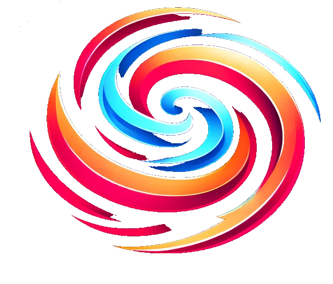

<p align="center">
  
  <br>
  <span style="font-size: larger;"><b>Ela Spark UI</b></span>
</p>


# ElaSpark-UI

ElaSpark-UI is a lightweight, customizable React library for creating responsive and animated modals with ease. 
Perfect for adding a touch of elegance and interactivity to your web projects.

## Features

- **Responsive**: Adapts perfectly to all screen sizes.
- **Customizable**: Wide range of styles and animations.
- **Easy to Use**: Simple interface for quick integration.
- **Lightweight**: Optimized not to weigh down your project.
- **Flexible Buttons**: Add customizable buttons with various functions.

## Installation

```bash
npm install elaspark-ui
```

You can install ElaSpark-UI via npm:

To use ElaSpark-UI in your React project, follow these simple steps:

1. Import ElaSpark-UI:

```jsx
import { Modal } from 'elaspark-ui';
```

2. Use Modal in your React component:

```jsx
function App() {
  return (
    <Modal size="m-m" styleType="style-1" centered>
      {/* Modal content here */}
    </Modal>
  );
}
```

## Modal Structure and Customization

### Modal Containers
- **`.modal-header`**: Container for the image/logo and modal title.
  - Use this class to create a distinct header within your modal.
- **`.modal-logo`**: Class for the image or logo in the header.
  - This class defines the image or logo size to 30% of the container width.
- **`.modal-title`**: Class for the title in the header.
  - This class allocates 70% of the container width for the modal title.
- **`.modal-content`**: Container for the main body of the modal.
  - Use this class to add text, images, or other elements in the modal body.

### Customizing Titles and Paragraphs
- To customize titles and paragraphs, use the following classes:
  - **`.t-1`**, **`.t-2`**, **`.t-3`**, **`.t-4`** for titles of different sizes.
  - **`.p-1`**, **`.p-2`**, **`.p-3`** for paragraphs of different sizes.
- You can also align these elements left, center, or right using **`.left`**, **`.center`**, **`.right`** classes.

### Usage Example:

```jsx
<Modal size="m-m" styleType="style-1" centered>
  <div className="modal-header">
    
    <div className="modal-title t-1 center">Your Title Here</div>
  </div>
  <div className="modal-content">
    <p className="p-1 left">Your text here.</p>
    {/* Other contents */}
  </div>
</Modal>;
```

## You can customize your modal by passing different props. Here are some examples:

### Basic Modal Example

```jsx
<Modal
  size="m-l"
  styleType="style-2"
  animation="slideInFromTop"
  title={{ text: 'Titre Modal', size: '1' }}
  paragraph={{ text: 'Paragraph content.', size: '1' }}
  logoSrc="/path/to/your/logo.png"
>
  {/* Other custom content here */}
</Modal>
```


### You can create a highly customized modal by composing the layout with predefined classes. 
Here's an example showing how to integrate a logo, title, and textual content with specific layout and animation:

```jsx
import { Modal } from "elaspark-ui";

function CustomModalExample() {
  return (
    <Modal
      size="m-l"
      styleType="style-5"
      backdropStyle="indigo"
      animation="neon-violet"
      centered
      title={{ size: "2", text: "Modal Title", align: "center" }}
      paragraph={{ size: "2", text: "Paragraph content.", align: "center" }}
      logoSrc="/path/to/your/logo.png"
    >
      {/* Custom content here */}
    </Modal>
  );
}
```

## Modal with Image and Text

```jsx
<Modal size="m-xl" styleType="style-5" centered>
  
  <div className="modal-title t-3">"Image Title"</div>
  <p className="modal-paragraph p-1">
    Description or content associated with the image.
  </p>
</Modal>;
```

## Predefined Styles:

## Customizing Sizes

### Use the following classes to define your modal size:

- **m-xxs:** Extra Extra Small
- **m-xs:** Extra Small
- **m-s:** Small
- **m-m:** Medium
- **m-l:** Large
- **m-xl:** Extra Large
- **m-xxl:** Extra Extra Large

### ElaSpark-UI offers a variety of predefined styles to customize the appearance of your modals. Use the `styleType` prop to choose from the following styles:

- **style-1:** Elegant and Classic
- **style-2:** Modern with Colored Outline
- **style-3:** Minimalist with Large Shadow
- **style-4:** Elegant Card with Gray Background
- **style-5:** Dark and Sophisticated
- **style-7:** Indigo
- **style-8:** Minimalist with Blue Background
- **style-9:** Subtle Elegance with Soft Shadow
- **style-10:** Dark with Colored Border
- **style-11:** Bright with Thin Colored Border
- **style-12:** Teal Green
- **style-13:** Deep Indigo

## Modal Backgrounds

### Customize the background of your modal using the `backdropStyle` prop:

- **dark:** A dark background with opacity
- **light:** A light background with opacity
- **dark-opaque:** A very dark background with higher opacity 
- **light-opaque:** A light background with higher opacity
- **indigo:** An indigo-colored background
- **red:** A red background for a strong visual impact
- **green:** A green background for a natural touch
- **blue-light:** A light blue background for a soothing ambiance
- **pink-light:** A light pink background for a soft touch
- **yellow-light:** A light yellow background for a cheerful ambiance
- **purple:** A purple background for a touch of elegance
- **clear:** No background, allowing the modal to blend with the page's background


## Animations

### Animate your modal using the `animation` prop:

### Fade In
- **Animation Name**: `fadeIn`
- **Description**: Gradually makes the modal appear.

### Fade Out
- **Animation Name**: `fadeOut`
- **Description**: Gradually makes the modal disappear.

### Flash
- **Animation Name**: `flash`
- **Description**: Creates a flash effect by alternating opacity.

### Soft Blink
- **Animation Name**: `softBlink`
- **Description**: Gently makes the modal blink.

### Gradual Disappear
- **Animation Name**: `gradualDisappear`
- **Description**: Gradually makes the modal disappear with a gradual effect.

### Gradual Appear
- **Animation Name**: `gradualAppear`
- **Description**: Gradually makes the modal appear with a gradual effect.

### Sparkle
- **Animation Name**: `sparkle`
- **Description**: Creates a rapid twinkling effect.

### Rotate
- **Animation Name**: `rotate`
- **Description**: Rotates the modal around its center.

### Swell
- **Animation Name**: `swell`
- **Description**: Makes the modal swell, making it appear larger.

### Shrink
- **Animation Name**: `shrink`
- **Description**: Reduces the size of the modal, making it appear smaller.

### Starry Night Violet Neon
- **Animation Name**: `neon-purple`
- **Description**: Violet neon animation, evoking a starry night.

### Starry Night Blue Neon
- **Animation Name**: `neon-blue`
- **Description**: Calm blue gradient, perfect for a tranquil effect.

### Green Neon
- **Animation Name**: `neon-green`
- **Description**: Vibrant green neon for a lively and fresh look.

### Red Neon
- **Animation Name**: `neon-red`
- **Description**: Bold red neon for a strong visual impact.

### Orange Neon
- **Animation Name**: `neon-orange`
- **Description**: Warm orange glow for a cozy, inviting feel.

### Pink Neon
- **Animation Name**: `neon-pink`
- **Description**: Playful pink neon, ideal for a whimsical touch.

### Yellow Neon
- **Animation Name**: `neon-yellow`
- **Description**: Bright yellow neon for an optimistic vibe.

### Neon Border
- **Animation Name**: `border-neon`
- **Description**: Multi-colored border for a dynamic appearance.

### Neon Border Blue Purple
- **Animation Name**: `border-neon-blue-purple`
- **Description**: Alternating blue and purple for a stylish look.

### Neon Border Red Orange
- **Animation Name**: `border-neon-red-orange`
- **Description**: Vibrant red and orange border for an energetic feel.

### Neon Border Green Yellow
- **Animation Name**: `border-neon-green-yellow`
- **Description**: Refreshing green and yellow border for a lively style.

### Neon Border Rainbow
- **Animation Name**: `border-neon-rainbow`
- **Description**: Rainbow border cycling through various hues.


## Modal with Animation

```jsx
import { Modal } from "elaspark-ui";

function AnimatedModalExample() {
  return (
    <Modal
      size="m-l"
      styleType="style-4"
      animation="softBlink"
      title={{ text: "Modal Title", size: "1" }}
      paragraph={{ text: "Paragraph content here.", size: "1" }}
      logoSrc="/path/to/your/logo.png"
    >
      {/* Additional custom content here */}
      <div className="modal-content">
        <h2 className="modal-title t-2">Your Custom Title</h2>
        <p className="modal-paragraph p-2">
          This is some custom content for the modal, which can include text,
          images, or other elements.
        </p>
      </div>
    </Modal>
  );
}
```

## Accessibility in Modal Component

The `Modal` component is designed with accessibility features to ensure usability for users with assistive technologies.

### Key Accessibility Features:

- `aria-hidden`: Ensures the modal is appropriately hidden or shown to assistive technologies.
- `onKeyDown`: Handles keyboard interactions, like closing the modal with the Escape key.
- `role="dialog"`: Identifies the modal as a dialog to screen readers.
- `aria-modal="true"`: Indicates that the modal is a modal dialog, ensuring screen readers treat it as a focus trap.
- `aria-labelledby`: Associates the modal with its title for screen readers.
- `ref={setFocus}`: Manages focus within the modal to ensure the first focusable element is focused when the modal opens.

### Example Usage:

```jsx
<Modal
  ariaLabelledBy="modalTitle"
  onClose={handleCloseModal}
  // ... other props
>
  {/* Modal Content Here */}
</Modal>
```

# ElaSpark-UI Buttons

**ElaSpark-UI** offers a variety of customizable buttons that you can use in your modals and elsewhere in your React projects.

# Integrated Buttons

elaspark-ui modals can include customizable buttons for various actions. 
You can freely name them (e.g., "Accept", "Cancel", "Reject") and assign them specific functions, 
such as sending an API request or saving data in local storage.

```jsx
<Modal>
  {/* Contenu */}
  <button
    onClick={() => {
      /* Your code for making an API request or storing in local storage */
    }}
  >
    Accepter
  </button>
  <button
    onClick={() => {
      /* Code to cancel or close the modal */
    }}
  >
    Annuler
  </button>
</Modal>;
```

## Using the Buttons

To use ElaSpark-UI buttons, import the `Button` component and use it in your application:

```jsx
import { Button } from 'elaspark-ui';

function App() {
  return (
    <Button onClick={() => console.log('Clicked!')}>
      Cliquer ici
    </Button>
  );
}
```

## Customizing Buttons

### You can customize your buttons using various props for size, style, animations, and borders:

```jsx
<Button
  size="b-m"
  styleType="btn-1"
  animation="wave"
  borderStyle="b-b-2"
  onClick={() => {/* Your code here */}}
>
  Custom Button
</Button>
```

## Button Sizes
### Set the size of your buttons using the following classes:

- **b-s:** Small
- **b-m:** Medium
- **b-l**: Large
- **b-xl:** Extra Large

## Button Styles

### Various styles are available to customize the appearance of the buttons:

- **btn-1:** Blue
- **btn-2:** Green
- **btn-3:** Yellow
- **btn-4:** Teal
- **btn-5:** Red
- **btn-6:** Orange
- **btn-7:** Purple
- **btn-8:** Mint Green
- **btn-9:** Indigo
- **btn-10:** Pink

## Button Borders
### Customize the borders of your buttons:

- **b-b-1:** Standard Solid Border
- **b-b-2:** Dotted Border
- **b-b-3:** Dashed Border
- **b-b-4:** Thicker Border
- **b-b-5:** Rounded Border
- **b-b-6:** Double Border
- **b-b-7:** Grooved Border
- **b-b-8:** Inset Border
- **b-b-9:** Shadowed Border
- **b-b-10:** Wavy Border

## Usage Examples

### Button with Action

```jsx
<Button
  size="b-m"
  styleType="btn-1"
  onClick={() => {/* Your action here */}}
>
  Action
</Button>
```

## Button Containers and Alignment
Use the `ButtonContainer` to group and align buttons together. The `align` prop can be used for both `ButtonContainer` and individual `Button` components to control their alignment.

### ButtonContainer Alignment:
- **`align="right"`:** Aligns all buttons inside the container to the right.
- **`align="center"`:** Centers all buttons inside the container.
- **`align="left"`:** Aligns all buttons inside the container to the left.
- **`align="auto"`:** Automatically spaces buttons inside the container.

### Individual Button Alignment:
- **`align="right"`:** Aligns the button to the right within its container.
- **`align="left"`:** Aligns the button to the left within its container.

### Usage Example:

```jsx
<ButtonContainer align="center">
  <Button align="right" size="b-m" styleType="btn-10">Close</Button>
  <Button align="left" size="b-m" styleType="btn-2">Action</Button>
</ButtonContainer>
```

## Accessibility

The `Button` component in our library supports several accessibility attributes to ensure a better user experience for people using assistive technologies.

### Available Accessibility Attributes:

- **`ariaLabel`:** Provides an accessible label for the button.
- **`ariaPressed`:** Indicates whether the button is pressed or not (for toggle buttons).
- **`ariaDisabled`:** Indicates if the button is disabled.
- **`ariaExpanded`:** Indicates if the button controls the expansion of another element.
- **`ariaHaspopup`:** Indicates if the button opens a menu or panel.
- **`ariaControls`:** Identifies the element controlled by the button.
- **`role`:** Defines the role of the button (default is `"button"`).
- **`tabIndex`:** Defines the tabbing order of the button.

### Usage Example:

```jsx
<Button
  ariaLabel="Close"
  ariaPressed={false}
  onClick={handleClose}
>
  Close
</Button>
```

## Button Styles and Animations

ElaSpark-UI also offers a variety of styles and animations for buttons, 
allowing you to tailor them to the look and feel of your application.

## Using Animations

To apply an animation to a button, use the `animation` prop with the desired animation name.

```jsx
import { Button } from 'elaspark-ui';

function App() {
  return (
    <Button animation="wave">
      Animated Button
    </Button>
  );
}
```

## Wave Effect
- **Animation Name**: `wave`
- **Description**: Creates a wave effect on the button on hover.

## Drop Shadow
- **Animation Name**: `shadow`
- **Description**: Adds a drop shadow to the button when hovered.

## Rotate
- **Animation Name**: `rotate`
- **Description**: Rotates the button on hover.

## Pulse
- **Animation Name**: `pulse`
- **Description**: Creates a pulsing effect on the button.

## Swing
- **Animation Name**: `swing`
- **Description**: Gives a swinging effect to the button.

## Vertical Stretch
- **Animation Name**: `stretchVertical`
- **Description**: Stretches the button vertically on hover.

## Horizontal Stretch
- **Animation Name**: `stretchHorizontal`
- **Description**: Stretches the button horizontally on hover.

## Bounce
- **Animation Name**: `bounce`
- **Description**: Creates a bouncing effect for the button.

## Blur
- **Animation Name**: `blur`
- **Description**: Applies a blur effect to the button on hover.

## Color Fade
- **Animation Name**: `colorFade`
- **Description**: Gradually changes the background color of the button on hover.

## Usage Examples

```jsx
<Button animation="wave">
  Wave Effect
</Button>
```

```jsx
<Button animation="shadow">
  Drop Shadow
</Button>
```

```jsx
<Button animation="swing">
  Swing
</Button>
```

```jsx
<Button animation="pulse">
  Pulse
</Button>
```

## Using in a Modal
Easily integrate buttons into your modals:

```jsx
import { Modal, Button } from 'elaspark-ui';

function MyComponent() {
  return (
    <Modal size="m-m" styleType="style-1">
      <div className="b-container b-c">
        <Button size="b-m" styleType="btn-1" animation="wave">Accept</Button>
        <Button size="b-m" styleType="btn-2" animation="pulse">Cancel</Button>
      </div>
    </Modal>
  );
}
```

### Modal Example with Right-Aligned Buttons

```jsx
import { Modal, Button } from 'elaspark-ui';

function ModalWithRightAlignedButtons() {
  return (
    <Modal size="m-l" styleType="style-2">
      <p>Your content here ...</p>
      <div className="b-container b-r">
        <Button size="b-m" styleType="btn-3">Details</Button>
        <Button size="b-m" styleType="btn-4" animation="rotate">More</Button>
      </div>
    </Modal>
  );
}
```

### Modal Example with Colored Buttons

```jsx
import { Modal, Button } from 'elaspark-ui';

function ModalWithColoredButtons() {
  return (
    <Modal size="m-m" styleType="style-3">
      <h2>Confirm your choice</h2>
      <div className="b-container b-c">
        <Button size="b-s" styleType="btn-5" borderStyle="b-b-5">Yes</Button>
        <Button size="b-s" styleType="btn-6" animation="bounce">No</Button>
      </div>
    </Modal>
  );
}
```

### Modal Example with Uniformly Spaced Buttons

```jsx
import { Modal, Button } from 'elaspark-ui';

function ModalWithEvenlySpacedButtons() {
  return (
    <Modal size="m-xl" styleType="style-4">
      <p>Important message ...</p>
      <div className="b-container b-auto">
        <Button size="b-l" styleType="btn-7">Accept</Button>
        <Button size="b-l" styleType="btn-8" animation="shadow">Reject</Button>
      </div>
    </Modal>
  );
}
```

# BONUS: Modal Example with Actions

## Save to Local Storage

In this example, the "Save" button stores information in localStorage.

```jsx
import React from "react";
import { Modal, Button } from "elaspark-ui";

function ModalLocalStorage() {
  const handleLocalStorageSave = () => {
    localStorage.setItem("myData", "Value to save");
    console.log("Data saved in localStorage");
  };

  return (
    <Modal size="m-m" styleType="style-1" backdropStyle="light">
      <div className="b-container b-c">
        <Button size="b-m" styleType="btn-1" onClick={handleLocalStorageSave}>
          Save
        </Button>
        <Button size="b-m" styleType="btn-2">
          Cancel
        </Button>
      </div>
    </Modal>
  );
}
```

## Modal Example with Button to Send Data to an API

```jsx
import React from "react";
import { Modal, Button } from "elaspark-ui";

function ModalApiSubmit() {
  const handleApiSubmit = () => {
    fetch("https://myapi.com/send", {
      method: "POST",
      body: JSON.stringify({ data: "Mes Données" }),
      headers: { "Content-Type": "application/json" },
    })
      .then((response) => response.json())
      .then((data) => console.log(data))
      .catch((error) => console.error("API Error:", error));
  };

  return (
    <Modal size="m-m" styleType="style-1" backdropStyle="dark">
      <div className="b-container b-c">
        <Button size="b-m" styleType="btn-3" onClick={handleApiSubmit}>
          Send API
        </Button>
        <Button size="b-m" styleType="btn-4">
          Cancel
        </Button>
      </div>
    </Modal>
  );
}
```

### In this example, the "Send API" button sends data to an API.

Created with ❤️ by Stephane-OC

## License

ElaSpark-UI is distributed under the MIT License. 
This license permits use, modification, and free distribution, provided that the MIT License text is included with any substantial distribution of the software. 
For more information, please refer to the `LICENSE` file included with this distribution or visit [MIT License](https://opensource.org/licenses/MIT).